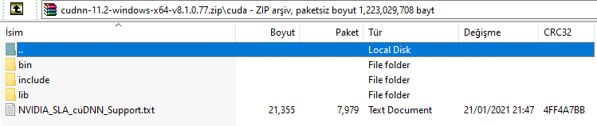
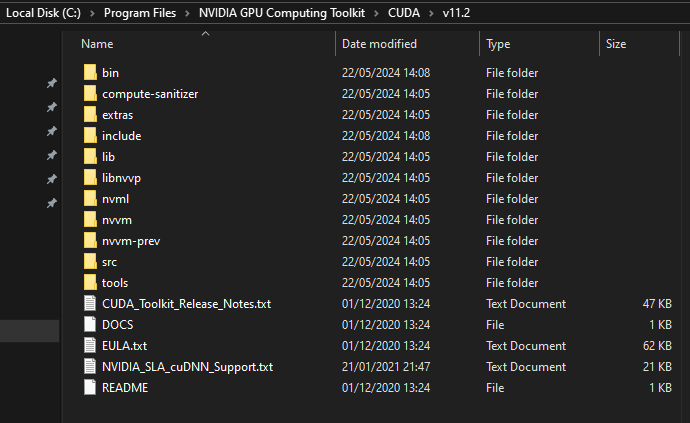
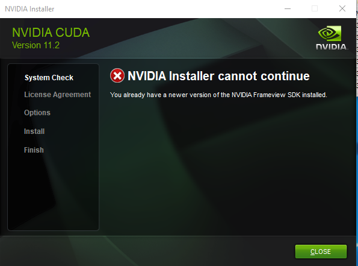

# Table of Contents

   * [About Repo](#about-repo)
   * [Download Pages](#download-pages)
   * [How to Install CUDA](#how-to-install-cuda)
   * [Possible Problems and Notes](#possible-problems-and-notes)
   * [Authors](#authors)

# About Repo
How to install and use CUDA properly. Then, how to use it by using tensorflow and numba.

Follow steps below [How to Install CUDA](#how-to-install-cuda)

It has been tested in Windows.

Please do not hesitate to contact.

# Download Pages
Python == 3.10.0

    https://www.python.org/downloads/

TensorFlow == 2.11.0

    pip install tensflow==2.11.0

TensorFlow-GPU == 2.9.0

    pip install tensorflow-gpu==2.9.0

Cuda == 11.2

    https://developer.nvidia.com/cuda-11.2.0-download-archive?target_os=Windows&target_arch=x86_64&target_version=10&target_type=exelocal

CuDNN == 8.1.0

    https://developer.download.nvidia.com/compute/redist/cudnn/

# How to Install CUDA
    Intallation of Cuda and using it on tensorflow has 7 steps: 
   1. **Uninstall** old tensorflow and all its components (tensorflow-gpu, tensorflow-intel )
   2. **Check** Compability between components ([Link](https://www.tensorflow.org/install/source_windows)):
        * *Python Version*
        * *Tensorflow Version*
        * *CUDA SDK Version*
        * *CudaDNN Version*
   3. If it is necessary, install different python version. Tensorflow-gpu does not support higher than python 3.10 up to now.
   4. Install Nvidia Graphics Card & Drivers (you most probably already have)
   5. Download and install CUDA SDK **(compatible one)**
   6. Download CudaDNN **(compatible one)** zip file, and extract them on where cuda installed. most probably --> C:\Program Files\NVIDIA GPU Computing Toolkit\CUDA\v11.2 

&darr; &darr; &darr; Inside the zip file &darr; &darr; &darr;

&darr; &darr; &darr; Where to extract &darr; &darr; &darr;

   7. Verify by simple program on cmd. 

    python tf_check.py

# Possible Problems and Notes

Be sure uninstall all Cuda components like listed below. Solution [Link](https://forums.developer.nvidia.com/t/nvidia-installer-cannot-continue/169854)

    - NVIDIA Frameview SDK
    - NVIDIA PhysX

&darr; &darr; &darr; Possible Problem &darr; &darr; &darr;

During tensorflow-gpu installation some dependencies cannot reach desired versions. Solve to run below.

    pip install tensorflow-gpu --use-deprecated=legacy-resolver

# Author

### Muhammet Ali Aykanat 

#### Reach Via  

